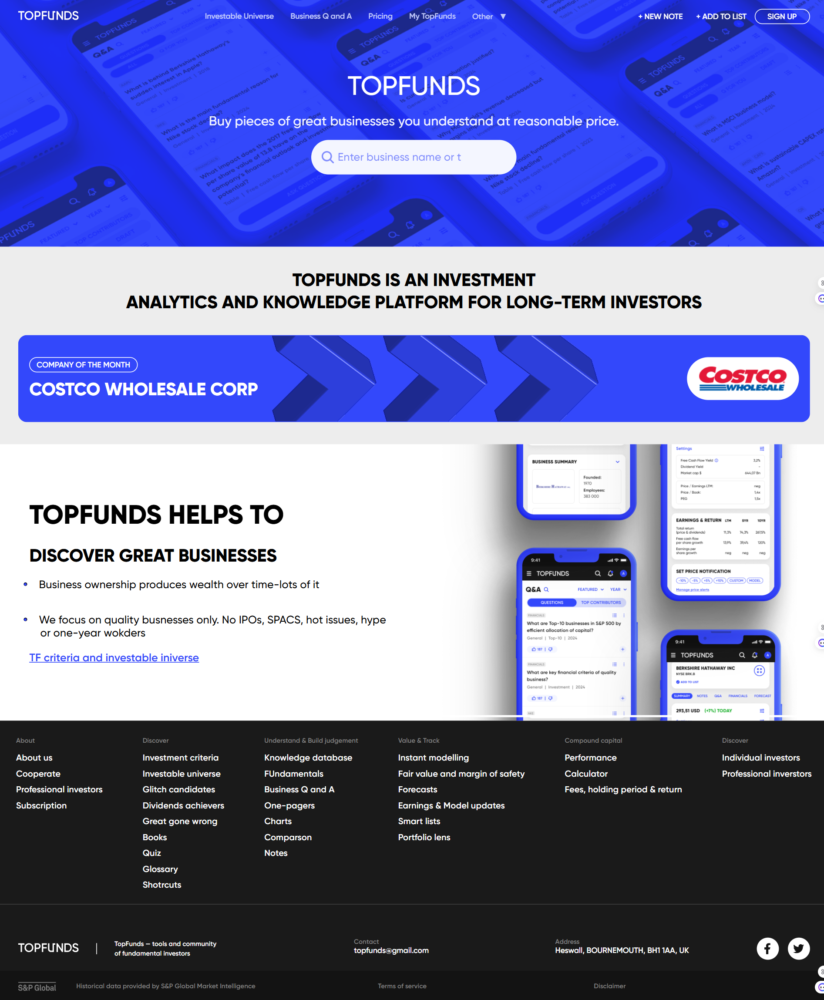
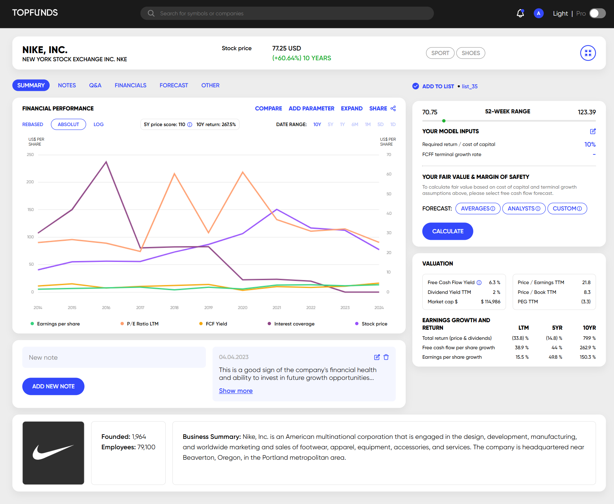
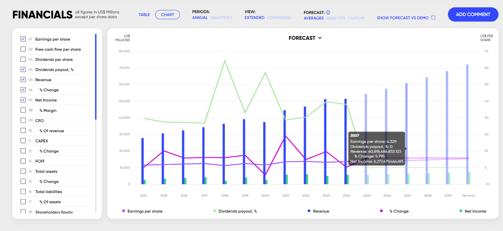
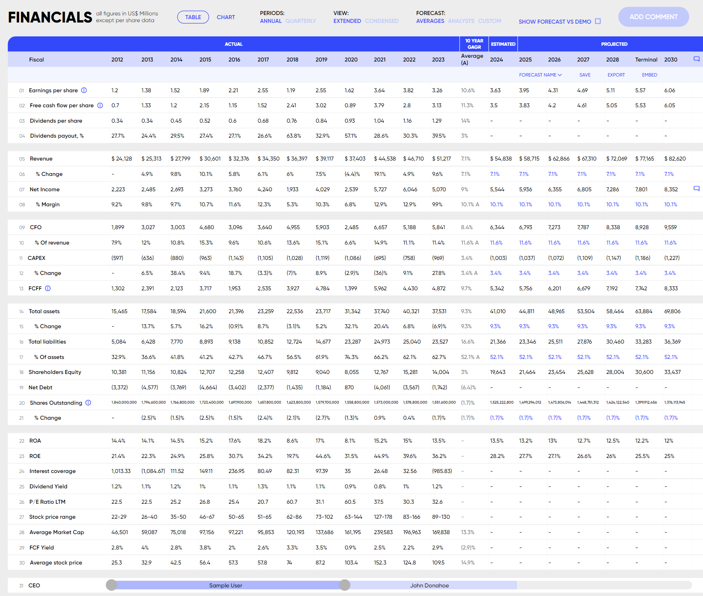

Please Check This [link](https://staging.topfunds.com/company/NKE)

## Project setup
```
yarn install
```

### Compiles and hot-reloads for development
```
yarn serve
```

### Compiles and minifies for production
```
yarn build
```

### Lints and fixes files
```
yarn lint
```

### Customize configuration
See [Configuration Reference](https://cli.vuejs.org/config/).


This is the home page and the summary page.

# Main page...


# This is the chart of stock price...


# This is the table of financial data...


# This is the NKE company...



